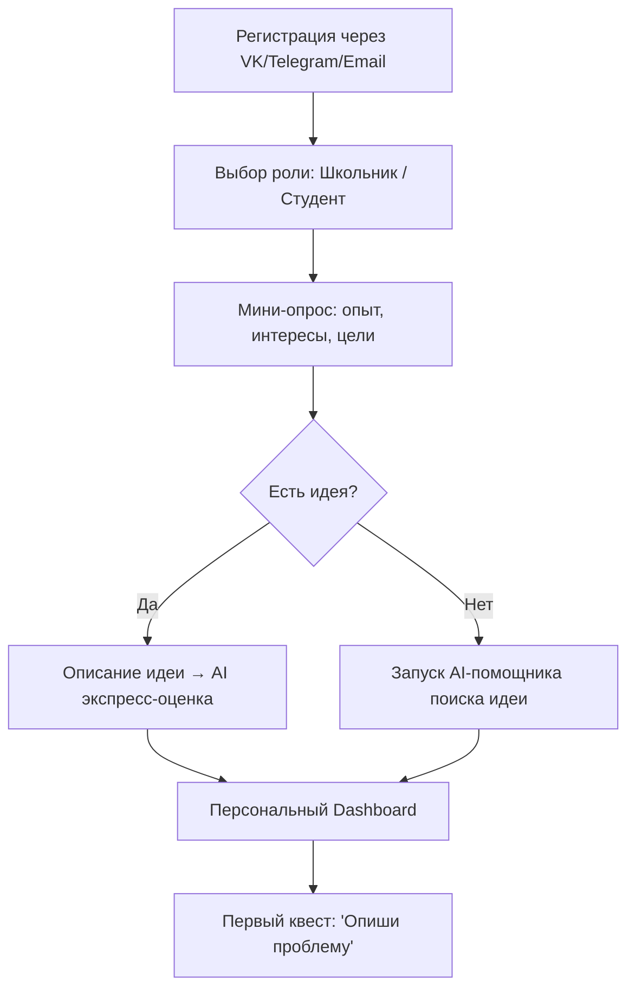
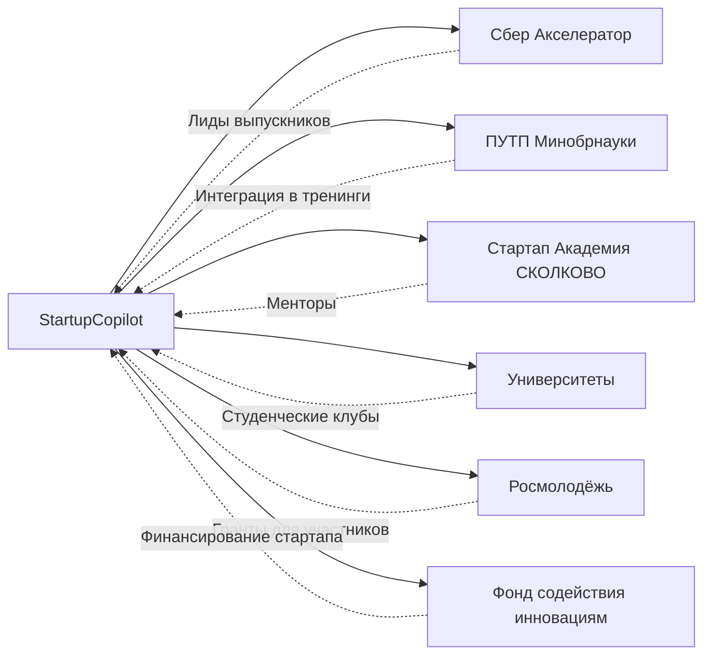

# 🚀 StartupCopilot — AI-платформа для молодых стартаперов

> **Миссия:** Сделать создание стартапа доступным и понятным для каждого школьника и студента с помощью персонального ИИ-наставника.

---

## 1. Проблема и контекст

### Боли целевой аудитории

| Боль | Школьники (14–18) | Студенты (18–25) |
|---|---|---|
| **Не знаю с чего начать** | Нет понимания, что такое стартап и как это работает | Есть идеи, но нет структуры и методологии |
| **Некому помочь** | Менторы недоступны, учителя не разбираются | Преподаватели далеки от бизнеса, менторы заняты |
| **Страх ошибки** | Боятся выглядеть глупо перед друзьями | Не готовы рисковать временем и ресурсами |
| **Нет навыков** | Не умеют делать презентации, считать юнит-экономику | Разрозненные знания, нет системного подхода |
| **Нет команды** | Не знают, где искать со-основателей | Сложно найти людей с complementary skills |

### Рыночный контекст

- **Сбер** запустил школьный (8–11 класс) и студенческий акселераторы — значит есть спрос
- **ПУТП** (Платформа университетского технологического предпринимательства) от Минобрнауки — тренинги, акселераторы, гранты «Студенческий стартап» до 1 млн ₽
- Стартап Академия **СКОЛКОВО**, бизнес-инкубатор **ВШЭ**, **Росмолодёжь.Гранты**
- Проект **«Первое дело»** от Сбера и «Деловой среды» — бесплатный онлайн-акселератор

> [!IMPORTANT]
> **Ключевой инсайт:** Все существующие программы — это **офлайн-акселераторы с ограниченными потоками**. Нет единой AI-платформы, которая была бы доступна 24/7 и вела молодого предпринимателя от идеи до питча.

---

## 2. Конкурентный анализ

### Прямые конкуренты (международные)

| Платформа | Что делает | Сильные стороны | Слабые стороны |
|---|---|---|---|
| **LeanPivot.ai** | AI-инструменты на основе Lean Startup | Персоны, pivot-анализ, Value Proposition Canvas | Не для молодёжи, сложный UX, на английском |
| **ValidatorAI** | AI-валидация бизнес-идей | Быстрая обратная связь, простой интерфейс | Только валидация, нет дальнейшего сопровождения |
| **PitchBob.io** | AI-генерация питч-деков и бизнес-планов | Красивые презентации, financial projections | Фокус на документы, а не на процесс обучения |
| **PrometAI** | AI бизнес-планирование | BMC, SWOT, финмодели | Корпоративный тон, не для школьников |
| **Young Founders Lab** | Инкубатор для школьников | Нетворкинг, гранты, менторство | Офлайн, ограниченная география (США) |

### Конкуренты в России

| Платформа | Что делает | Зазор для нас |
|---|---|---|
| **Школьный акселератор Сбера** | 3-месячная программа, от идеи до питча | Ограниченные потоки, нет AI, нет 24/7 доступа |
| **Студенческий акселератор Сбера** | Тестирование идей, привлечение клиентов | Привязка к семестрам, нет персонализации |
| **ПУТП / Стартап-студии** | Тренинги + акселераторы при вузах | Бюрократия, медленные процессы |
| **«Первое дело»** | Онлайн-акселератор | Нет AI, линейный формат без адаптации |

### Наше конкурентное преимущество

```
                    Офлайн акселераторы        StartupCopilot
                    ─────────────────────      ──────────────────
Доступность:        Ограниченные потоки   →    24/7, в любом городе
Персонализация:     Один формат для всех  →    AI адаптирует под уровень
Скорость:           3–6 месяцев           →    Свой темп, от 2 недель
Менторство:         Раз в неделю          →    AI-ментор в реальном времени
Стоимость:          Часто бесплатно       →    Freemium модель
Масштабируемость:   50–100 команд         →    Неограниченно
```

---

## 3. Продукт: Core Features

### 3.1 🤖 AI Startup Copilot (ядро)

Персональный ИИ-агент, который проводит пользователя через весь путь создания стартапа:

**Этап 1: Поиск идеи**
- Сократический диалог: AI задаёт вопросы о проблемах, интересах, навыках
- Генерация идей на основе трендов и pain points целевых рынков
- Оценка идей по фреймворку ICE (Impact, Confidence, Ease)

**Этап 2: Валидация**
- AI проводит custdev-интервью в формате ролевой игры (симуляция клиентов)
- Автоматический анализ конкурентов по описанию идеи
- Генерация и тестирование гипотез

**Этап 3: Бизнес-модель**
- Интерактивный Business Model Canvas с AI-подсказками
- Расчёт юнит-экономики с объяснением каждого метрика
- Value Proposition Canvas

**Этап 4: MVP**
- Рекомендации по no-code инструментам для создания MVP
- Генерация user stories и product roadmap
- Чеклисты и шаблоны для запуска

**Этап 5: Питч**
- AI-генератор питч-деков (10–15 слайдов)
- Тренажёр питча: AI играет роль инвестора и задаёт каверзные вопросы
- Обратная связь по публичным выступлениям (анализ текста)

### 3.2 📚 Startup Academy (образовательный модуль)

- **Микро-уроки** (5–10 мин): Lean Startup, BMC, юнит-экономика, CustDev, JTBD
- **Кейсы**: разбор реальных стартапов (успехи и провалы)
- **Квизы** после каждого урока
- Контент адаптируется под возраст: школьникам — проще и с примерами из жизни, студентам — глубже

### 3.3 🏆 Gamification Engine

| Элемент | Описание | Мотивация |
|---|---|---|
| **XP (опыт)** | За прохождение этапов, уроков, активность | Ощущение прогресса |
| **Уровни основателя** | Dreamer → Explorer → Builder → Launcher → Founder | Статус и гордость |
| **Бейджи** | «Первая идея», «CustDev Master», «Pitch Perfect» | Коллекционирование |
| **Стрики** | Серия дней активности на платформе | Формирование привычки |
| **Лидерборд** | По школе/вузу, по городу, общий | Соревновательность |
| **Сезонные челленджи** | «Стартап за 48 часов», «Валидируй идею за неделю» | Срочность и драйв |

### 3.4 👥 Community & Team Building

- **Профили участников** с навыками, интересами, ролями (Hustler / Hacker / Hipster)
- **Team Matching**: AI подбирает со-основателей по complementary skills
- **Командные spaces**: канбан-доска, чат, shared документы
- **Менторский маркетплейс**: студенты-менторы для школьников, предприниматели для студентов
- **Peer Review**: команды оценивают проекты друг друга

### 3.5 📊 Startup Dashboard

- Визуальный прогресс по стадиям стартапа
- Метрики проекта: stage, team size, validated hypotheses, MVP status
- AI-рекомендации «что делать дальше»
- Интеграция с внешними сервисами (Google Forms для опросов, Figma для прототипов)

---

## 4. User Flow

### 4.1 Onboarding (первые 5 минут)



### 4.2 Основной пользовательский путь

```
┌─────────────────────────────────────────────────────────────┐
│                    DISCOVERY (Неделя 1–2)                   │
│  ┌──────────┐   ┌──────────┐   ┌──────────────┐           │
│  │ Генерация│──▶│ Оценка   │──▶│ Выбор лучшей │           │
│  │ идей     │   │ идей     │   │ идеи         │           │
│  └──────────┘   └──────────┘   └──────────────┘           │
└──────────────────────┬──────────────────────────────────────┘
                       ▼
┌─────────────────────────────────────────────────────────────┐
│                  VALIDATION (Неделя 2–4)                    │
│  ┌──────────┐   ┌──────────┐   ┌──────────────┐           │
│  │ CustDev  │──▶│ Анализ   │──▶│ Pivot или    │           │
│  │ (AI-сим) │   │ конкур.  │   │ продолжаем   │           │
│  └──────────┘   └──────────┘   └──────────────┘           │
└──────────────────────┬──────────────────────────────────────┘
                       ▼
┌─────────────────────────────────────────────────────────────┐
│                  BUILD (Неделя 4–8)                         │
│  ┌──────────┐   ┌──────────┐   ┌──────────────┐           │
│  │ BMC +    │──▶│ MVP План │──▶│ Создание MVP │           │
│  │ Unit Eco │   │          │   │ (no-code)    │           │
│  └──────────┘   └──────────┘   └──────────────┘           │
└──────────────────────┬──────────────────────────────────────┘
                       ▼
┌─────────────────────────────────────────────────────────────┐
│                  LAUNCH (Неделя 8–12)                       │
│  ┌──────────┐   ┌──────────┐   ┌──────────────┐           │
│  │ Pitch    │──▶│ Тренажёр │──▶│ Demo Day     │           │
│  │ Deck     │   │ питча    │   │ (виртуальный)│           │
│  └──────────┘   └──────────┘   └──────────────┘           │
└─────────────────────────────────────────────────────────────┘
```

### 4.3 Ключевые экраны

1. **Dashboard** — прогресс-бар стадий, AI-рекомендации, квесты дня
2. **AI Chat** — основной экран работы с ИИ-наставником
3. **Workspace** — канвасы (BMC, VPC), документы, файлы проекта
4. **Academy** — курсы, микро-уроки, квизы
5. **Community** — лента, профили, team matching
6. **Pitch Studio** — генератор деков, тренажёр выступлений

---

## 5. Монетизация

### Freemium модель

| | Free | Pro (990₽/мес) | Team (1990₽/мес) |
|---|---|---|---|
| AI-чат | 20 сообщений/день | Безлимит | Безлимит |
| Генерация идей | 3 идеи | Безлимит | Безлимит |
| BMC / VPC | 1 проект | 5 проектов | 10 проектов |
| Pitch Deck | Базовый шаблон | Премиум шаблоны | Кастомные шаблоны |
| Тренажёр питча | — | ✅ | ✅ |
| Team Matching | — | ✅ | ✅ |
| Менторство | — | — | ✅ |
| Командный space | — | — | ✅ |
| Academy | Базовый курс | Все курсы | Все курсы + сертификаты |

### Дополнительные потоки дохода

- **B2B**: подписки для школ и вузов (лицензии на класс/группу)
- **B2G**: партнёрство с Минобрнауки, региональными программами
- **Интеграция с акселераторами**: канал лидогенерации для Сбера, СКОЛКОВО, ПУТП
- **Сертификаты**: платные сертификаты о прохождении программы

---

## 6. Go-to-Market стратегия

### 6.1 Привлечение школьников (14–18)

| Канал | Стратегия | Метрика |
|---|---|---|
| **TikTok** | Короткие видео: «Создай стартап за 60 секунд», истории успеха, AI-мемы | Views, подписчики |
| **Telegram** | Бот-тизер с экспресс-оценкой идеи, каналы со стартап-контентом | Подписчики бота |
| **VK** | Группы, таргет на 14–18 лет, конкурсы | Переходы |
| **Школы** | Партнёрства с директорами, бесплатные мастер-классы | Школы-партнёры |
| **Олимпиады** | Спонсорство/партнёрство с бизнес-олимпиадами | Регистрации |
| **Инфлюенсеры** | Коллаборации с edu-блогерами и молодыми предпринимателями | Охват |

### 6.2 Привлечение студентов (18–25)

| Канал | Стратегия | Метрика |
|---|---|---|
| **Telegram** | Каналы про стартапы, гранты, карьеру | Подписчики |
| **Вузы** | Интеграция в программы предпринимательства, стартап-клубы | Вузы-партнёры |
| **Хакатоны** | Спонсорство, стенды, призы в виде подписок | Регистрации |
| **Product Hunt / vc.ru** | Launch на продуктовых платформах | Upvotes, трафик |
| **Сарафанное радио** | Реферальная программа: пригласи друга → +7 дней Pro | Инвайты |
| **SEO** | Контент: «Как создать стартап студенту», «Бизнес-идеи 2026» | Органический трафик |

### 6.3 Ключевые партнёрства



---

## 7. Технический стек (рекомендация)

| Компонент | Технология | Почему |
|---|---|---|
| **Frontend** | Next.js + Tailwind CSS | SSR, производительность, адаптивность |
| **Backend** | Supabase (Postgres + Auth + Edge Functions) | Быстрый запуск, масштабируемость |
| **AI** | OpenAI GPT-4o / Claude API + LangChain | Качество диалога, tool calling |
| **Realtime** | Supabase Realtime | Чат, коллаборация |
| **Storage** | Supabase Storage | Файлы проектов, pitch decks |
| **Analytics** | PostHog | Open-source, product analytics |
| **Gamification** | Custom + PostgreSQL | Гибкость, полный контроль |

---

## 8. MVP Scope (4–6 недель)

### Must Have (v0.1)
- [x] Регистрация / авторизация (Supabase Auth)
- [ ] Onboarding опрос (школьник/студент, опыт, цели)
- [ ] AI Chat — персональный ИИ-наставник (GPT-4o)
- [ ] Генерация и оценка бизнес-идей
- [ ] Интерактивный Business Model Canvas
- [ ] Базовая геймификация (XP, уровни)
- [ ] Dashboard с прогрессом

### Nice to Have (v0.2)
- [ ] Тренажёр питча
- [ ] Генерация Pitch Deck
- [ ] Community (профили, лента)
- [ ] Team Matching
- [ ] Микро-уроки (Academy)

### Future (v1.0)
- [ ] Менторский маркетплейс
- [ ] Виртуальные Demo Days
- [ ] B2B подписки для школ/вузов
- [ ] Мобильное приложение
- [ ] Интеграция с внешними акселераторами

---

## 9. Метрики успеха

### North Star Metric
**Количество проектов, дошедших до стадии MVP** — это показывает реальную ценность платформы.

### Ключевые метрики

| Категория | Метрика | Цель (6 мес) |
|---|---|---|
| Activation | % прошедших onboarding | > 70% |
| Engagement | DAU/MAU | > 30% |
| Retention | 30-day retention | > 40% |
| Core Value | Проекты со стадии Idea → MVP | > 15% |
| Revenue | Конверсия Free → Pro | > 5% |
| Growth | Organic signups (WoW) | +10% |

---

## 10. Риски и митигация

| Риск | Вероятность | Влияние | Митигация |
|---|---|---|---|
| AI галлюцинации в бизнес-советах | Высокая | Высокое | RAG на проверенных фреймворках, disclaimer |
| Низкая retention у школьников | Высокая | Среднее | Усилить геймификацию, push-уведомления, стрики |
| Конкуренция с бесплатными программами Сбера | Средняя | Высокое | Позиционирование как дополнение, а не замена |
| Сложность объяснения бизнес-концепций подросткам | Средняя | Среднее | Адаптивный контент, примеры из жизни |
| Юридические риски (работа с несовершеннолетними) | Средняя | Высокое | Согласие родителей, GDPR-compliant |

---

## 11. Уникальное позиционирование

> **«StartupCopilot — это не курс и не акселератор. Это твой AI со-основатель, который доступен 24/7, знает все фреймворки и никогда не скажет, что твоя идея глупая.»**

### Ключевые дифференциаторы:
1. **AI-first** — ИИ не дополняет, а является ядром продукта
2. **Возрастная адаптация** — контент и тон подстраиваются под школьника или студента
3. **Геймификация** — путь основателя как RPG-игра, а не скучный курс
4. **Безбарьерный вход** — бесплатный тариф даёт достаточно, чтобы начать
5. **Мост к реальным программам** — подготовка к подаче в акселераторы Сбера, ПУТП, СКОЛКОВО
