# V2 Implementation Plan: Целостность, Вовлечение и Retention

## Обзор

Платформа StartupCopilot имеет рабочий фундамент (auth, AI chat, Journey Map, workspace tools, pitch deck), но страдает от **критических проблем интеграции**: gamification-код не подключён к пользовательскому flow, entry points сломаны, навигация битая. Также отсутствует ощущение единого пути из-за disconnected UX.

**Подход:** 10 коротких спринтов (~1 неделя, 3-5 задач каждый). Fix first → integration → new features → social.

---

## Граф зависимостей спринтов

```mermaid
graph LR
  S06[S06: Critical Fixes] --> S07[S07: Gamification Wiring]
  S07 --> S08[S08: Learning & Navigation]
  S08 --> S09[S09: Smart Chat]
  S09 --> S10[S10: Celebrations & Feedback]
  S10 --> S11[S11: Lesson Personalization]
  S11 --> S12[S12: CustDev Simulator + Scorecard]
  S12 --> S13[S13: Social: Peer Review & Gallery]
  S13 --> S14[S14: Social: Teams & Challenges]
  S14 --> S15[S15: Daily Quest & Polish]
```

---

## Sprint 06 — Critical Fixes (~1 нед)

**Цель:** Починить сломанное — progress tracking, entry points, навигация.

| # | Задача | Описание |
|---|--------|----------|
| S06-001 | **Починить progress tracking** | Отладить `update-project-artifacts.ts`: убрать silent catch → нормальный error handling. Добавить `revalidatePath('/dashboard')` в API route `/api/chat`. Добавить логирование. Проверить RLS policies. |
| S06-002 | **Починить entry points** | Chat page читает `searchParams.context`. Передаёт в `ChatWindow` как начальный `contextType`. 4 пути работают: `idea_search`, `idea_evaluation`, `project_assessment`, `learning`. |
| S06-003 | **Починить навигацию** | Sidebar: `/academy` → `/learning`. Sidebar: показывать реальные данные пользователя (level, XP, display_name, avatar). BottomNav: аналогично. |
| S06-004 | **Убрать ContextSwitcher** | Заменить кликабельные вкладки на read-only badge с текущей стадией проекта. AI сам определяет контекст. |

---

## Sprint 07 — Gamification Wiring (~1 нед)

**Цель:** Подключить существующий код gamification к пользовательскому flow.

| # | Задача | Описание |
|---|--------|----------|
| S07-001 | **Подключить стрики** | Вызывать `updateStreak(userId)` в `(main)/layout.tsx` при каждом заходе. Показать 🔥 в Sidebar рядом с level. |
| S07-002 | **Подключить XP к действиям** | Вызывать `awardXP()` при: завершении урока (+20), квизе (+10), завершении checklist item (+15), сохранении артефакта (+10), завершении стадии (+50). |
| S07-003 | **Подключить achievements** | Вызывать `checkAchievements()` после каждого `awardXP()`. При unlock — возвращать данные бейджа для показа. |
| S07-004 | **XP Toast** | Компонент `XPToast.tsx` — анимированный toast "+20 XP 🎉" при начислении. Global context через React Context или Zustand. |

---

## Sprint 08 — Learning & Navigation (~1 нед)

**Цель:** Страница обучения + два типа уроков.

| # | Задача | Описание |
|---|--------|----------|
| S08-001 | **Создать `/learning/page.tsx`** | Обзорная страница: уроки сгруппированы по стадиям, прогресс ✅/❌, AI-рекомендация "что пройти дальше" на основе `project.stage`. |
| S08-002 | **Два типа уроков: миграция** | Добавить поле `type` в таблицу `lessons`: `'micro'` (3 мин, inline) или `'full'` (8-10 мин, отдельная страница). Обновить seed data. |
| S08-003 | **Micro-уроки: inline cards** | Компонент `MicroLessonCard.tsx` — компактная карточка урока для Dashboard/чеклиста. 1-2 абзаца + 1 quiz вопрос. Завершается in-place. |
| S08-004 | **Full-уроки: отдельная страница** | `/learning/[lessonId]/page.tsx` — полная страница с контентом, множеством квизов, callouts. "← Назад к урокам". |

---

## Sprint 09 — Smart Chat (~1 нед)

**Цель:** AI понимает контекст без ручного переключения, entry points работают полноценно.

| # | Задача | Описание |
|---|--------|----------|
| S09-001 | **Auto-routing AI** | При отсутствии `?context=` — AI определяет тему из первого сообщения и автоматически подбирает промпт. Новый tool `detect_context` в base prompt. |
| S09-002 | **Entry point: "У меня есть идея"** | AI после описания идеи вызывает `save_idea` + `create_project_with_stage` автоматически. Redirect на Dashboard c Journey Map. |
| S09-003 | **Entry point: "У меня уже проект"** | AI задаёт 3-5 вопросов → определяет стадию → создаёт проект на нужной стадии с pre-filled прогрессом. |
| S09-004 | **Entry point: "Хочу учиться"** | Redirect на `/learning` вместо чата. AI-рекомендация на странице. |

---

## Sprint 10 — Celebrations & Feedback (~1 нед)

**Цель:** Визуальная обратная связь — confetti, modals, level up.

| # | Задача | Описание |
|---|--------|----------|
| S10-001 | **Level Up Modal** | Полноэкранная модалка при повышении уровня: новый уровень, иконка, поздравление. `canvas-confetti` для эффектов. |
| S10-002 | **Achievement Unlock Modal** | Модалка при получении бейджа: иконка, название, описание, XP reward. |
| S10-003 | **Stage Completion Celebration** | Confetti + toast при завершении всех пунктов стадии. Unlock-анимация следующей стадии в Journey Map. |
| S10-004 | **AI проактивное приветствие** | При заходе в чат без проекта → AI приветствует по имени и предлагает начать. С проектом → предлагает продолжить с последнего шага. |

---

## Sprint 11 — Lesson Personalization (~1 нед)

**Цель:** Контекстные уроки, адаптированные под проект пользователя.

| # | Задача | Описание |
|---|--------|----------|
| S11-001 | **Template variables в уроках** | В JSONB-контенте поддержка `{{project.title}}`, `{{project.problem}}`, `{{project.target_audience}}`. Замена при рендеринге в `LessonContent.tsx`. |
| S11-002 | **AI-рекомендация урока в чате** | Когда пользователь затрудняется, AI предлагает конкретный урок и объясняет как он поможет. Deep link на `/learning/{lessonId}`. |
| S11-003 | **Контекстный квиз** | Вопросы типа "Какой главный pain point в проекте «{{project.title}}»?" — привязаны к данным проекта. Новый тип quiz block: `contextual_quiz`. |

---

## Sprint 12 — CustDev Simulator + Startup Scorecard (~1 нед)

**Цель:** AI-фичи для реалистичной практики и объективной оценки проекта.

| # | Задача | Описание |
|---|--------|----------|
| S12-001 | **AI CustDev Simulator** | Отдельный чат-режим: AI играет роль потенциального клиента из ЦА пользователя. Использует `target_audience` и `problem` для реалистичных ответов. После сессии — AI дает фидбэк: что хорошо, что улучшить в вопросах. |
| S12-002 | **Startup Scorecard** | AI оценивает готовность стартапа по 10 критериям (проблема, ЦА, валидация, бизнес-модель, MVP и т.д.) от 0 до 100. Spider chart / radar chart на Dashboard. Обновляется при каждом прогрессе. |
| S12-003 | **Scorecard History** | График прогресса scorecard во времени: "3 недели назад ваш Score был 23, сейчас 67". Мотивация через визуальный рост. |

---

## Sprint 13 — Social: Peer Review & Gallery (~1 нед)

**Цель:** Первый уровень социальных взаимодействий — просмотр и оценка чужих работ.

| # | Задача | Описание |
|---|--------|----------|
| S13-001 | **Публичная галерея проектов** | Страница `/discover` — карточки проектов с названием, стадией, Scorecard. Пользователь может "опубликовать" свой проект (opt-in). Фильтры: по стадии, по Score, последние. |
| S13-002 | **Peer Review: запрос фидбека** | Кнопка "Попросить фидбэк" на BMC/VPC/Pitch → создаёт review request. Другие пользователи видят в ленте. |
| S13-003 | **Peer Review: оставить фидбэк** | Страница review: видишь чужой BMC/Pitch (read-only) + оставляешь комментарии по блокам. Фидбэк приходит автору. +XP за полезный ревью. |
| S13-004 | **Reactions & Kudos** | Лайки/reactions на проекты в галерее. "🔥 Hot", "💡 Creative", "📊 Well-researched". Топ проектов за неделю. |

---

## Sprint 14 — Social: Teams & Challenges (~1 нед)

**Цель:** Групповые взаимодействия и совместная работа.

| # | Задача | Описание |
|---|--------|----------|
| S14-001 | **Co-founder Matching** | Профиль пользователя: навыки (dev, design, marketing, sales), роль, тайм-зона. Страница `/match` — люди ищут со-основателей. Алгоритм: комплементарные навыки + совпадение стадии. |
| S14-002 | **Startup Challenges (недельные)** | Общие челленджи: "Эта неделя: заполни BMC за 7 дней". Собственный seed + AI-генерация. Прогресс виден всем участникам. Топ-3 → бонус XP + эксклюзивный бейдж. |
| S14-003 | **Discussion Feed** | Лента `/community` — посты типа "Ребят, как лучше считать LTV для SaaS?". Привязка к стадии. Ответы + upvotes. AI может подсказывать. |
| S14-004 | **Study Groups (Когорты)** | Группы по 5-7 человек, проходят стадии вместе. Общий чат, общий прогресс. Групповые milestone celebrations. |

---

## Sprint 15 — Daily Quest & Polish (~1 нед)

**Цель:** Daily Quest + финальная полировка + PWA.

| # | Задача | Описание |
|---|--------|----------|
| S15-001 | **Daily Quest Engine** | `src/lib/gamification/daily-quest.ts` — генерация квеста на основе стадии + progress. Типы: урок, чеклист, артефакт, quiz, peer review. |
| S15-002 | **Daily Quest UI** | Карточка на Dashboard: "🎯 Квест дня: Заполни Customer Segments в BMC (+15 XP)". Click → переход к действию. |
| S15-003 | **Streak Freeze** | 1 "заморозка" бесплатно в неделю. Таблица streak_freezes. UI: кнопка "❄️ Заморозить" если не заходил вчера. |
| S15-004 | **PWA + Push Notifications** | Service Worker + manifest.json. Push: "Не сломай стрик 🔥!", "Новый квест ждёт", "Кто-то оставил ревью на твой BMC". |
| S15-005 | **Weekly Progress Report** | AI генерирует мини-отчёт: что сделано за неделю, сравнение, рекомендация. Показывается на Dashboard по понедельникам. |

---

## 💡 Дополнительные идеи (backlog, после S15)

| Фича | Описание | Влияние |
|------|----------|---------|
| **🎓 Certification** | При прохождении всех 5 стадий → сертификат PDF "Прошёл путь от идеи до питча" | 🟢🟢 |
| **📈 Admin Analytics** | Метрики: среднее время на стадию, % completion, drop-off points | 🟢 |
| **🔄 Multi-project** | Поддержка нескольких проектов, переключение | 🟢 |
| **🎤 Pitch Battle** | Еженедельное голосование: лучший питч получает XP + featured spot | 🟢🟢🟢 |
| **📧 Email Digests** | Стрик напоминание, weekly report, новые ревью | 🟢🟢 |
| **🧑‍🏫 Mentorship Program** | Пользователи Level 4-5 могут менторить новичков. Mentor получает XP за ревью | 🟢🟢🟢 |
| **📱 Share Progress Card** | Генерация OG-image: "Я на стадии MVP, Score 72/100" для соцсетей | 🟢🟢 |

---

## Verification Plan

### Автоматизированное
- `npm run build` — проверка что всё компилируется после каждого спринта
- `npx tsc --noEmit` — type checking

### Ручная проверка (после каждого спринта)
1. **S06:** Зарегистрировать нового пользователя → выбрать entry point → проверить что чат открывается в правильном контексте → через чат описать проблему → проверить progress на Dashboard
2. **S07:** Зайти на платформу → проверить стрик в Sidebar → пройти урок → проверить +20 XP toast → открыть страницу Gamification → проверить бейджи
3. **S08:** Открыть `/learning` → увидеть уроки по стадиям → открыть micro-урок inline → открыть full-урок на отдельной странице
4. **S09:** Создать нового пользователя → выбрать "У меня есть идея" → описать идею → проверить автосоздание проекта → проверить Journey Map
5. **S10:** Набрать достаточно XP для level up → проверить модалку → завершить стадию → проверить confetti
6. **S12:** Открыть CustDev Simulator → провести интервью → получить фидбэк. Проверить Scorecard на Dashboard
7. **S13:** Опубликовать проект → найти его в галерее → запросить ревью → оставить комментарий на чужой BMC
8. **S14:** Открыть matching → посмотреть рекомендации. Вступить в challenge → проверить общий прогресс
