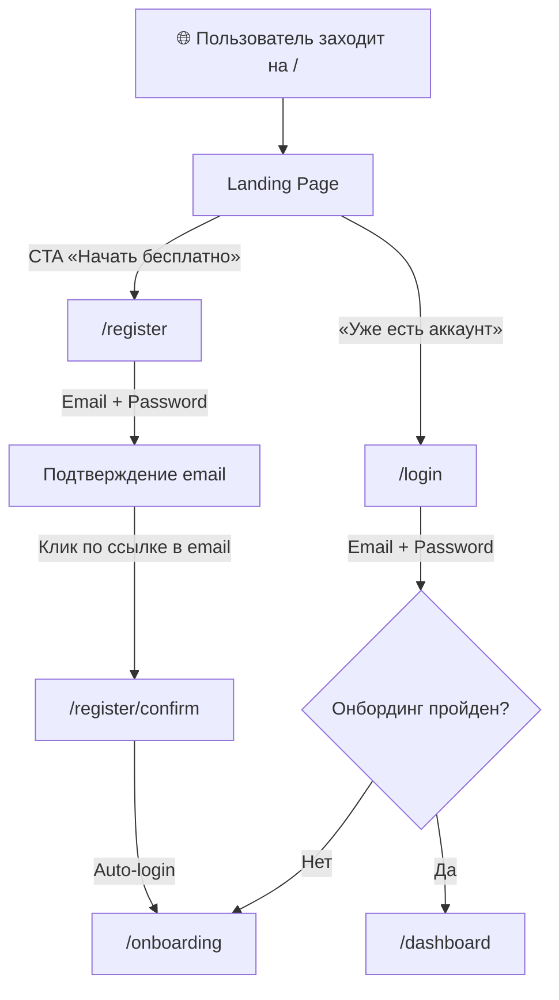
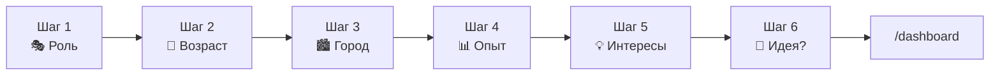
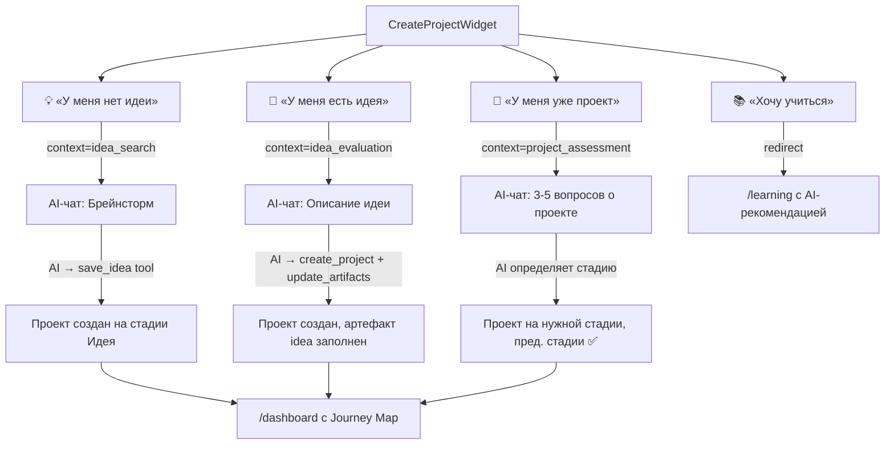
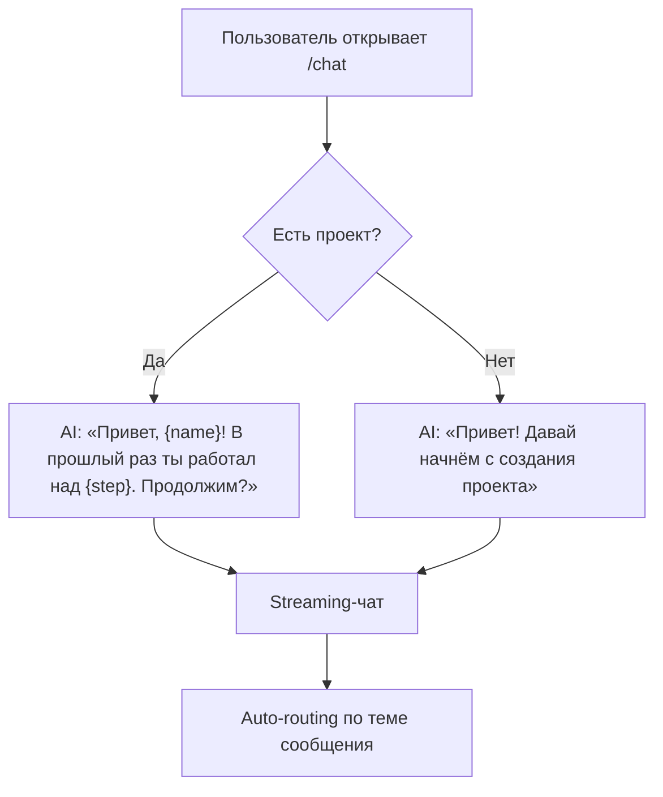
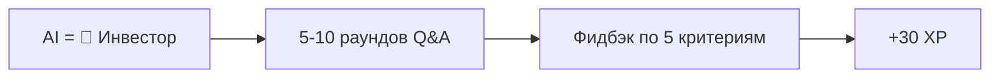
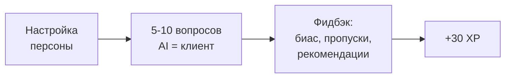
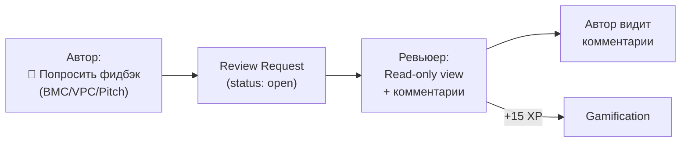
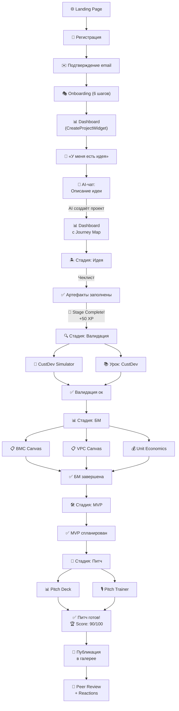

# StartupCopilot — Полный User Flow

> Документация по состоянию после Sprint 15 (Март 2026)
> 22 страницы, 8 модулей, 60+ компонентов

---

## 📋 Оглавление

1. [Обзор платформы](#обзор-платформы)
2. [Архитектура страниц](#архитектура-страниц)
3. [Flow 1: Первое знакомство → Регистрация](#flow-1-первое-знакомство--регистрация)
4. [Flow 2: Onboarding](#flow-2-onboarding)
5. [Flow 3: Dashboard — точка входа](#flow-3-dashboard--точка-входа)
6. [Flow 4: Создание проекта (4 Entry Points)](#flow-4-создание-проекта-4-entry-points)
7. [Flow 5: Journey Map — путь стартапа](#flow-5-journey-map--путь-стартапа)
8. [Flow 6: AI-чат (Наставник)](#flow-6-ai-чат-наставник)
9. [Flow 7: Workspace — бизнес-инструменты](#flow-7-workspace--бизнес-инструменты)
10. [Flow 8: Обучение (Academy)](#flow-8-обучение-academy)
11. [Flow 9: Геймификация](#flow-9-геймификация)
12. [Flow 10: Социальные функции](#flow-10-социальные-функции)
13. [Flow 11: PWA и уведомления](#flow-11-pwa-и-уведомления)
14. [Карта навигации](#карта-навигации)
15. [Роли и адаптация](#роли-и-адаптация)

---

## Обзор платформы

**StartupCopilot** — AI-платформа для школьников и студентов, помогающая пройти путь от идеи до питча стартапа. Платформа использует GigaChat (через LangChain) как AI-наставника, геймификацию для вовлечения, и социальные функции для обучения через комьюнити.

### Технологический стек
- **Frontend:** Next.js 15 (App Router), TypeScript strict, Tailwind CSS v4, shadcn/ui, Framer Motion
- **Backend:** Supabase (Auth, PostgreSQL, pgvector, Edge Functions, RLS)
- **AI:** GigaChat SDK (langchain-gigachat), RAG (pgvector), Function calling
- **Extras:** PWA, Web Push API, canvas-confetti, recharts

### Целевая аудитория
| Роль | Возраст | Тон AI |
|------|---------|--------|
| 🎒 Школьник | 14-17 лет | Дружелюбный, простой язык, больше примеров |
| 🎓 Студент | 18-25 лет | Деловитый, терминология, глубокий анализ |

---

## Архитектура страниц

```
/ .......................... Landing page (маркетинговая)
├── /login ................. Вход
├── /register .............. Регистрация
│   └── /register/confirm .. Подтверждение email
├── /onboarding ............ Multi-step онбординг (6 шагов)
│
├── /dashboard ............. Главная (Journey Map / Create Project)
├── /chat .................. AI-наставник (streaming)
│
├── /workspace/
│   ├── /bmc ............... Business Model Canvas (9 блоков)
│   ├── /vpc ............... Value Proposition Canvas (6 зон)
│   ├── /unit-economics .... Калькулятор юнит-экономики
│   ├── /pitch ............. Pitch Deck Wizard (10 слайдов)
│   ├── /pitch/trainer ..... Тренажёр питча (AI=инвестор)
│   └── /custdev ........... CustDev Simulator (AI=клиент)
│
├── /learning .............. Обзор уроков (по стадиям)
│   └── /learning/[id] ..... Полная страница урока
│
├── /gamification .......... Бейджи и достижения
│
├── /discover .............. Галерея публичных проектов
│   └── /discover/review/[id] Peer Review (read-only + комментарии)
├── /community ............. Лента обсуждений
├── /match ................. Поиск со-основателей
├── /challenges ............ Недельные челленджи
└── /groups ................ Учебные группы (когорты)
```

---

## Flow 1: Первое знакомство → Регистрация



### Landing Page (`/`)
- **Hero:** Заголовок display size (Plus Jakarta Sans), подзаголовок, CTA-кнопка
- **«Как это работает»:** 3-4 шага с иконками
- **«Возможности»:** Feature cards с анимациями
- **«Для кого»:** Школьники + студенты
- **Footer:** Ссылки, контакты
- **Анимации:** Fade-in при скролле, hover-эффекты
- **Responsive:** Mobile-first (375px → 768px → 1024px+)

### Регистрация (`/register`)
- Форма: `react-hook-form` + `zod` валидация
- Поля: email, пароль (минимум 6 символов)
- После отправки → redirect на `/register/confirm`
- Страница confirm ждёт подтверждения email → auto-login

### Логин (`/login`)
- Форма: email + password
- При успехе → redirect на `/dashboard` (или `/onboarding` если не пройден)

---

## Flow 2: Onboarding



### 6 шагов онбординга (`/onboarding`)

| Шаг | Что собираем | UI |
|-----|--------------|----|
| 1. Роль | Школьник / Студент | Карточки с иконками |
| 2. Возраст | Числовое поле | Если <18 → предупреждение о согласии родителей |
| 3. Город + Учебное заведение | Текстовые поля | — |
| 4. Опыт | Новичок / Есть идеи / Был в бизнесе | Карточки |
| 5. Интересы | Tech, Edu, Health, Food, Social... | Multi-select chips |
| 6. Есть ли идея? | Да → текстовое поле / Нет → skip | — |

- **StepIndicator** — прогресс по шагам
- Анимированные переходы (Framer Motion)
- Сохранение в `profiles` через server action
- После завершения: `onboarding_completed = true` → redirect на `/dashboard`

---

## Flow 3: Dashboard — точка входа

Dashboard адаптируется в зависимости от наличия проекта:

### Без проекта
```
┌─────────────────────────────────────────────┐
│  👋 Привет, {name}! Давай начнём!           │
│                                             │
│  ┌──────────┐ ┌──────────┐                  │
│  │ 💡 Нет   │ │ 🎯 Есть  │                  │
│  │   идеи   │ │   идея   │                  │
│  └──────────┘ └──────────┘                  │
│  ┌──────────┐ ┌──────────┐                  │
│  │ 🚀 Уже   │ │ 📚 Хочу  │                  │
│  │  проект  │ │ учиться  │                  │
│  └──────────┘ └──────────┘                  │
│                                             │
│  📖 Мини-урок дня                           │
│  🎯 Квест дня: ... (+15 XP)                │
└─────────────────────────────────────────────┘
```

### С проектом
```
┌───────────────────────────────────────────────────────┐
│  👋 Привет, {name}! 🚀                               │
│                                                       │
│  ┌── Journey Map ──────────────────────────────────┐  │
│  │ 🏝️ Идея  →  🔍 Проверка  →  📊 БМ  → 🛠 MVP → 🎤│ │
│  │   ✅          ▶️            🔒       🔒       🔒 │  │
│  └─────────────────────────────────────────────────┘  │
│                                                       │
│  ┌── StageCard (текущая стадия) ──────────────────┐  │
│  │ 🔍 Валидация                        [3/5] ████░│  │
│  │  ✅ Определить проблему                        │  │
│  │  ✅ Описать целевую аудиторию                  │  │
│  │  ✅ Провести CustDev    [Начать с AI →]        │  │
│  │  ⬜ Проверить гипотезы  [Начать с AI →]        │  │
│  │  ⬜ Проанализировать результаты                │  │
│  └────────────────────────────────────────────────┘  │
│                                                       │
│  ┌── Scorecard ────┐  ┌── Score History ──────────┐  │
│  │  Spider chart    │  │  📈 Line chart            │  │
│  │  Score: 42/100   │  │  3 нед: 23 → 67 (+44) 🚀 │  │
│  └──────────────────┘  └──────────────────────────┘  │
│                                                       │
│  🎯 Квест дня: Заполни Customer Segments (+15 XP)    │
│  📊 Недельный отчёт (по понедельникам)               │
│  📖 Мини-урок дня: «ICE-оценка идеи»                │
│  👥 Команда: Hustler, Hacker, Hipster                │
│  [📢 Опубликовать проект]                             │
└───────────────────────────────────────────────────────┘
```

### Элементы Dashboard
| Компонент | Описание |
|-----------|----------|
| **JourneyMap** | 5 стадий, анимация текущей, lock/unlock |
| **StageCard** | Чеклист с кнопками «Начать с AI» и «Открыть инструмент» |
| **ScorecardRadar** | Spider chart по 10 критериям (recharts) |
| **ScorecardHistory** | Line chart динамики Score за 30 дней |
| **DailyQuestCard** | Квест дня + timer до сброса |
| **WeeklyReportCard** | AI-отчёт за неделю (по понедельникам) |
| **MicroLessonCard** | Мини-урок дня inline |
| **TeamSection** | Управление командой (имена + роли) |
| **CreateProjectWidget** | 4 entry points (если нет проекта) |

---

## Flow 4: Создание проекта (4 Entry Points)



### Детали каждого Entry Point

**💡 «У меня нет идеи»**
- Открывает `/chat?context=idea_search`
- AI приветствует: «Давай найдём идею! Расскажи о своих интересах...»
- Брейнсторм → генерация идей → ICE-оценка
- AI вызывает `save_idea` tool → проект создан

**🎯 «У меня есть идея»**
- Открывает `/chat?context=idea_evaluation`
- AI: «Расскажи свою идею, помогу оценить»
- AI вызывает `create_project` → `update_project_artifacts(idea_formulation)`
- Чеклист item `formulate_idea` автоматически ✅

**🚀 «У меня уже проект»**
- Открывает `/chat?context=project_assessment`
- AI задаёт 3-5 вопросов → определяет стадию
- Создаёт проект на правильной стадии, предыдущие стадии marked ✅

**📚 «Хочу учиться»**
- Redirect на `/learning`
- AI рекомендует вводный урок (или по стадии проекта)

---

## Flow 5: Journey Map — путь стартапа

### 5 стадий

| # | Стадия | Emoji | Инструменты | Уроки |
|---|--------|-------|-------------|-------|
| 1 | **Идея** | 🏝️ | — | Как найти идею, ICE-оценка |
| 2 | **Проверка** (Валидация) | 🔍 | CustDev Simulator | Что такое CustDev, Проверка гипотез |
| 3 | **Бизнес-модель** | 📊 | BMC, VPC, Unit Economics | Введение в BMC, Юнит-экономика |
| 4 | **MVP** | 🛠️ | — | Lean MVP, No-code инструменты |
| 5 | **Питч** | 🎤 | Pitch Deck, Pitch Trainer | Структура питч-дека, Инвесторы |

### Статусы стадий
- ✅ **completed** — все пункты чеклиста выполнены
- ▶️ **in_progress** — текущая стадия (пульсирующая анимация)
- 🔒 **locked** — стадия ещё не доступна (затемнена)
- ⚠️ **needs_revision** — AI предложил вернуться

### StageCard — раскрытие стадии
При клике на стадию открывается карточка с:
- **Чеклист** (3-5 пунктов на стадию, ~20 пунктов всего)
- **Кнопки действий:**
  - «Начать с AI →» — открывает контекстный чат
  - «Открыть [инструмент] →» — ведёт на BMC/VPC/Pitch и т.д.
  - «📘 Урок» — inline-урок (micro) или ссылка на full
- **Прогресс-бар** — X/Y пунктов выполнено
- При завершении всех пунктов → **confetti** + unlock следующей стадии + **+50 XP**

### Нелинейность
- AI может предложить вернуться к предыдущей стадии: `reopen_stage` → ⚠️ needs_revision
- Автоматическое обновление прогресса при работе с инструментами

---

## Flow 6: AI-чат (Наставник)

### Вход в чат (`/chat`)



### Архитектура чата
| Компонент | Описание |
|-----------|----------|
| **ChatWindow** | Основное окно с сообщениями |
| **MessageBubble** | User/Assistant пузыри с Markdown |
| **ChatInput** | Поле ввода + Send |
| **TypingIndicator** | Анимация набора AI |
| **StageBadge** | Read-only badge текущей стадии |
| **ToolResultCard** | Результаты tool calls (ICE score, saved idea) |
| **LessonSuggestion** | Кликабельная рекомендация урока |

### AI Capabilities
- **Streaming** — токены появляются в реальном времени
- **Markdown** — рендеринг заголовков, списков, кода (react-markdown)
- **Auto-routing** — AI определяет контекст по первому сообщению
- **Proactive welcome** — персональное приветствие при открытии
- **Tool calling** — 6+ инструментов:

| Tool | Функция |
|------|---------|
| `save_idea` | Сохраняет идею в проект |
| `evaluate_ice` | ICE-оценка (Impact, Confidence, Ease) |
| `create_project` | Создаёт проект из чата |
| `update_project_artifacts` | Обновляет артефакты проекта |
| `complete_checklist_item` | Отмечает пункт чеклиста ✅ |
| `reopen_stage` | Переоткрывает стадию для ревизии |
| `suggest_lesson` | Рекомендует релевантный урок |

### Context-aware промпты
- Промпт адаптируется по: стадии, роли (школьник/студент), прогрессу
- System prompt содержит: артефакты проекта, историю (последние 20 сообщений)
- RAG: инъекция top-3 релевантных чанков из базы знаний (10+ документов)

---

## Flow 7: Workspace — бизнес-инструменты

Все инструменты — full-page с кнопкой «← Назад к карте».

### BMC Canvas (`/workspace/bmc`)
```
┌─────────────┬─────────────┬──────────────┬─────────────┬────────────┐
│ Key Partners│ Key         │ Value        │ Customer    │ Customer   │
│             │ Activities  │ Props        │ Relations   │ Segments   │
│             │             │              │             │            │
│             ├─────────────┤              ├─────────────┤            │
│             │ Key         │              │ Channels    │            │
│             │ Resources   │              │             │            │
├─────────────┴─────────────┼──────────────┴─────────────┴────────────┤
│ Cost Structure            │ Revenue Streams                         │
└───────────────────────────┴─────────────────────────────────────────┘
```
- **9 блоков** в CSS Grid
- **Sticky Notes** — CRUD, drag-and-drop (dnd-kit)
- **AI подсказки** — BMCSuggestionPanel генерирует 3 подсказки для блока
- **Autosave** в `projects.bmc_data` JSONB
- **Progress tracking** — X/9 блоков → обновление `progress_data`
- **Экспорт в PDF** (`@react-pdf/renderer`)
- **Peer Review** — кнопка «Попросить фидбэк 📝»

### VPC Canvas (`/workspace/vpc`)
- **6 зон:** Gains, Pains, Jobs, Gain Creators, Pain Relievers, Products
- Sticky Notes в каждой зоне
- Autosave в `projects.vpc_data`
- Peer Review

### Unit Economics (`/workspace/unit-economics`)
- **Поля:** CAC, LTV, ARPU, Churn, Payback Period
- Автоматический расчёт
- **LTV/CAC ratio** визуализация (зелёный если > 3)
- Autosave в `projects.unit_economics`

### Pitch Deck Wizard (`/workspace/pitch`)
- **10 слайдов:** Обложка, Проблема, Решение, Рынок, Продукт, Бизнес-модель, Конкуренты, Юнит-экономика, Команда, Roadmap
- AI генерирует текст для каждого слайда
- BMC данные подтягиваются автоматически (слайд 6)
- **Экспорт в PDF**
- **Peer Review**

### Pitch Trainer (`/workspace/pitch/trainer`)

- AI играет роль инвестора, задаёт каверзные вопросы
- Фидбэк: оценки + рекомендации
- +30 XP за сессию

### CustDev Simulator (`/workspace/custdev`)

- AI играет роль потенциального клиента из ЦА
- Настройка персоны: возраст, роль, отношение (скептик/энтузиаст)
- Использует `target_audience` и `problem` из артефактов
- Фидбэк: хорошие вопросы, наводящие, пропущенные
- +30 XP за сессию

---

## Flow 8: Обучение (Academy)

### Обзор (`/learning`)
```
┌─────────────────────────────────────────────┐
│  📚 Обучение                                │
│                                             │
│  ⭐ Рекомендуем: «Что такое CustDev»       │
│                                             │
│  🏝️ Идея                                   │
│  ├── ✅ Как найти идею стартапа  [3 мин]    │
│  └── ⬜ ICE-оценка идеи         [5 мин]    │
│                                             │
│  🔍 Валидация                               │
│  ├── ⬜ Что такое CustDev        [5 мин]    │
│  └── ⬜ Проверка гипотез         [7 мин]    │
│  ...                                        │
└─────────────────────────────────────────────┘
```
- Уроки сгруппированы по 5 стадиям
- AI рекомендует следующий урок на основе `project.stage` и `progress_data`
- Статус: ✅ пройден / ⬜ не пройден

### Два типа уроков

| Тип | Формат | Где показывается | Длительность |
|-----|--------|-----------------|--------------|
| **Micro** | Inline card (expand/collapse) | Dashboard, StageCard | 1-3 мин |
| **Full** | Отдельная страница `/learning/[id]` | Страница Learning | 5-10 мин |

### Micro-уроки (`MicroLessonCard`)
- 1-2 абзаца текста + 1 quiz
- Expand/collapse анимация
- Завершение in-place → ✅ + XP toast
- Показывается на Dashboard как «📖 Мини-урок дня»

### Full-уроки (`/learning/[lessonId]`)
- Полная страница с контентом
- JSONB контент: heading, paragraph, callout, quiz
- Навигация «← Назад к урокам»
- % прохождения

### Персонализация уроков
- **Template variables:** `{{project.title}}`, `{{project.problem}}`, `{{project.target_audience}}`
- Если проекта нет → fallback на generic текст
- **Контекстный квиз:**
  - `contextual_quiz` — вопросы привязаны к данным проекта
  - `reflection` — нет правильного ответа, для размышления
  - `open` — свободный ввод, оценивается AI

### AI в обучении
- AI рекомендует урок в чате: `suggest_lesson` tool
- Кликабельная карточка-ссылка в сообщениях чата
- Рекомендация контекстная (основана на стадии)

### XP за обучение
| Действие | XP |
|----------|----|
| Завершение micro-урока | +20 |
| Завершение full-урока | +20 |
| Правильный ответ на quiz | +10 |

---

## Flow 9: Геймификация

### Система XP и уровней

| Уровень | Порог XP | Описание |
|---------|----------|----------|
| 1 | 0 | Новичок |
| 2 | 100 | Начинающий |
| 3 | 300 | Практик |
| 4 | 600 | Опытный |
| 5 | 1000 | Мастер |

### Начисление XP

| Действие | XP |
|----------|----|
| Завершение урока | +20 |
| Правильный ответ quiz | +10 |
| Checklist item complete | +15 |
| Артефакт сохранён через AI | +10 |
| Стадия полностью завершена | +50 |
| Pitch training сессия | +30 |
| CustDev Simulator сессия | +30 |
| Peer Review оставлен | +15 |
| Daily Quest выполнен | +15 |
| Streak milestone (3/7/14/30) | бонусный XP |

### Стрики 🔥
- Увеличивается при заходе каждый день (проверяется в layout SSR)
- При пропуске → сброс (или **Streak Freeze**)
- Milestone бонусы: 3, 7, 14, 30 дней
- Отображается в Sidebar: 🔥 {count}
- **Streak Freeze** ❄️ — 1 бесплатная заморозка в неделю

### Daily Quest 🎯
- Генерируется ежедневно на основе стадии и прогресса
- Типы: micro-урок, 1 блок BMC, checklist item, peer review, quiz
- Не повторяется подряд
- Timer до конца дня
- +15 XP за выполнение

### Достижения (15+ бейджей)
Примеры:
| Badge | Условие |
|-------|---------|
| 🌱 Первая идея | Создание первого проекта |
| 🔥 Разгон | 3 дня подряд |
| 📚 Первый урок | Прохождение 1 урока |
| 🏆 Мастер BMC | Заполнение всех 9 блоков |
| 🎤 Питчер | Тренировка питча |
| ... | ... |

### Визуальная обратная связь
- **XP Toast** — `+20 XP 🎉` slide-in + fade-out (3 сек)
- **Level Up Modal** — полноэкранная модалка с confetti (`canvas-confetti`)
- **Achievement Modal** — slide-up при получении бейджа (auto-dismiss 5 сек, очередь)
- **Stage Completion** — confetti burst + unlock-анимация следующей стадии

### Gamification Page (`/gamification`)
- Сетка всех бейджей: unlocked (цветные) / locked (серые)
- Текущий уровень и XP

### Weekly Report (по понедельникам)
- AI-генерированный отчёт за неделю
- Содержит: XP earned, уроков пройдено, items завершено
- Сравнение Score: было → стало
- AI рекомендация на следующую неделю

---

## Flow 10: Социальные функции

### Галерея проектов (`/discover`)
```
┌──────────────────────────────────────┐
│  🔍 Discover Projects               │
│  [Все] [По стадии ▾] [Ждут ревью]   │
│                                      │
│  ┌──────────┐  ┌──────────┐          │
│  │ EcoShop  │  │ StudyBud │          │
│  │ ✅ Pitch │  │ ▶️ BMC   │          │
│  │ Score:87 │  │ Score:45 │          │
│  │ 🔥12 💡8 │  │ 🔥3  📊5 │          │
│  └──────────┘  └──────────┘          │
│                                      │
│  🏆 Топ проектов за неделю           │
└──────────────────────────────────────┘
```

- **Публикация opt-in:** кнопка «📢 Опубликовать» на Dashboard
- **Карточки:** название, стадия, Score, аватар автора, reactions
- **Фильтры:** по стадии, по Score, «новые», «популярные», «ждут ревью»
- **Reactions:** 🔥 Hot, 💡 Creative, 📊 Well-researched (1 на тип от пользователя)

### Peer Review

- Кнопка «📝 Попросить фидбэк» на страницах BMC, VPC, Pitch
- Read-only просмотр чужих работ + комментарии по блокам
- Рейтинг 1-5
- +15 XP за оставленный ревью
- Уведомление автору

### Co-founder Matching (`/match`)
- Профиль: навыки (dev, design, marketing, sales, finance, product), роль, bio
- Флаг «ищу со-основателя»
- **Алгоритм:** комплементарные навыки + совпадение стадии
- Кнопка «Написать» → контакт

### Challenges (`/challenges`)
- Недельные челленджи (заполни BMC за 7 дней, пройди 3 урока, и т.д.)
- Присоединение + автоматический трекинг прогресса
- Топ-3 → бонус XP + эксклюзивный бейдж

### Discussion Feed (`/community`)
- Посты с привязкой к стадии
- Upvote/downvote + ответы (thread view)
- Фильтр по стадии

### Study Groups (`/groups`)
- Группы по 5-7 человек
- Создание + invite link (UUID)
- Групповой прогресс: средний Score
- Групповые milestone celebrations

---

## Flow 11: PWA и уведомления

### PWA
- `manifest.json` + Service Worker (`sw.js`)
- Установка как приложение
- Кэширование для offline-доступа

### Push-уведомления
| Триггер | Сообщение |
|---------|-----------|
| Не заходил до 20:00 | «Не сломай стрик 🔥!» |
| Утро | «Новый квест ждёт» |
| Получен ревью | «Кто-то оставил ревью на твой BMC» |

- Web Push API
- Supabase Edge Function для отправки
- Запрос разрешения при первом заходе

---

## Карта навигации

### Desktop — Sidebar (240px)
```
┌──────────────────────┐
│  StartupCopilot      │
│                      │
│  📊 Dashboard        │
│  💬 AI-наставник     │
│  📋 Workspace        │
│  📚 Learning         │
│  🏆 Gamification     │
│                      │
│  👥 Community        │
│  🔍 Discover         │
│  🤝 Match            │
│  🎯 Challenges       │
│  👨‍👩‍👧‍👦 Groups           │
│                      │
│  ──────────────────  │
│  👤 {display_name}   │
│  🔥 {streak} | ⭐ Lvl {n}│
│  ████████░░ {xp} XP  │
└──────────────────────┘
```

### Mobile (<768px) — Bottom Nav
```
┌─────────────────────────────────────┐
│  📊  💬  📋  📚  🏆                │
│  Home Chat Work Learn Game          │
└─────────────────────────────────────┘
```

---

## Роли и адаптация

### Адаптация AI тона
| Аспект | Школьник | Студент |
|--------|----------|---------|
| Язык | Простой, без терминов | Бизнес-терминология |
| Примеры | Из школьной жизни | Из бизнес-кейсов |
| Длина ответов | Короче, конкретнее | Развёрнутые, с анализом |
| Тон | Дружелюбный, игровой | Деловитый, менторский |

### Адаптация контента
- Уроки имеют поле `audience`: `all` / `school` / `university`
- Онбординг собирает роль → сохраняет в `profiles.role`
- AI промпты содержат: `if role === 'school' → ...`

---

## Startup Scorecard

### 10 критериев оценки

| Критерий | Источник данных |
|----------|----------------|
| Problem Clarity | `artifacts.problem` |
| Target Audience | `artifacts.target_audience` |
| Idea Validation | `artifacts.hypotheses` |
| Market Size | `artifacts.market_size` |
| CustDev | CustDev Simulator сессии |
| BMC | `bmc_data` (заполненность 9 блоков) |
| VPC | `vpc_data` (заполненность 6 зон) |
| Unit Economics | `unit_economics` |
| MVP Definition | `artifacts.mvp_plan` |
| Pitch | `pitch_decks.slides` |

- Каждый 0-100, рассчитывается из artifacts + progress_data
- Общий Score = weighted average
- Spider chart на Dashboard
- History chart — динамика за 30 дней
- Мотивация: «3 недели назад: 23 → Сейчас: 67 (+44) 🚀»

---

## Полный сценарий пользователя (Happy Path)



---

> **Последнее обновление:** Март 2026, после Sprint 15
